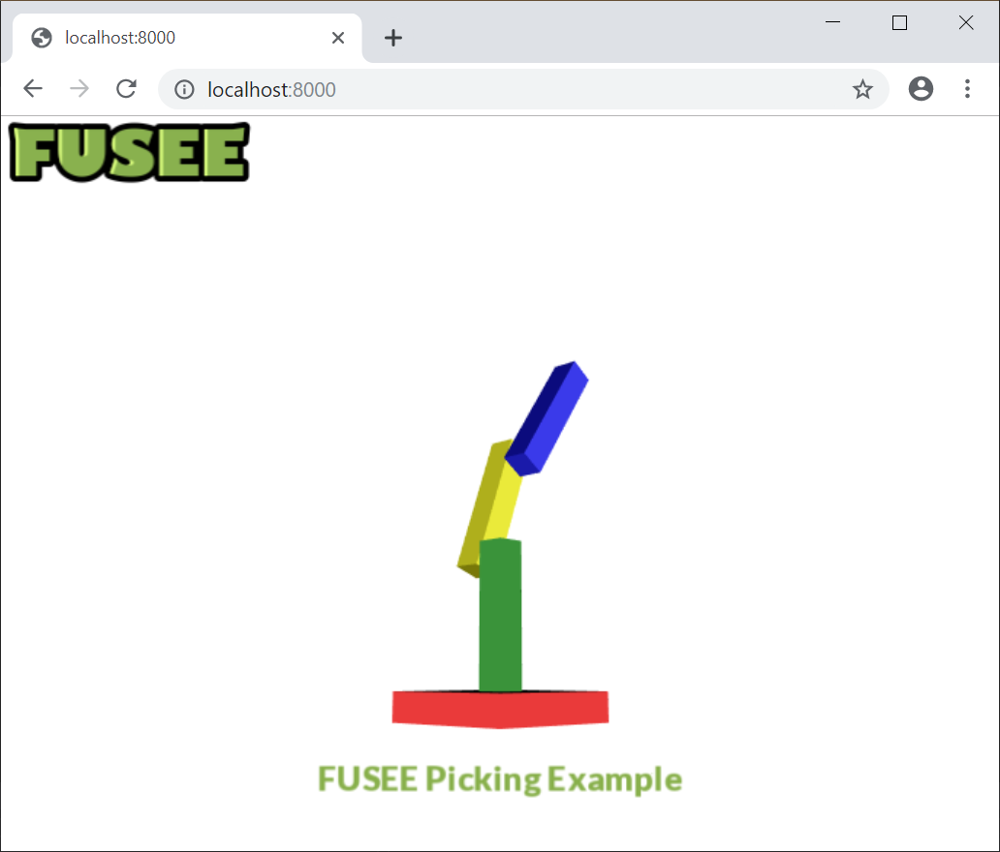

## [Rocket](rocket/)
__[FUSEE Rocket](rocket/) is a simple example which demonstrates asset loading (shaders, serialized *.fu scene files, textures, fonts) as well as our responsive GUI system.__

The source code can be found here: [Github](https://github.com/FUSEEProjectTeam/Fusee/tree/feature/wasm/Examples/Complete/WASM)

---

## [Picking](picking/)
**[FUSEE Picking](picking/) demonstrates picking.**

The source code can be found here: [Github](https://github.com/FUSEEProjectTeam/Fusee/tree/feature/wasm/Examples/Complete/Picking)